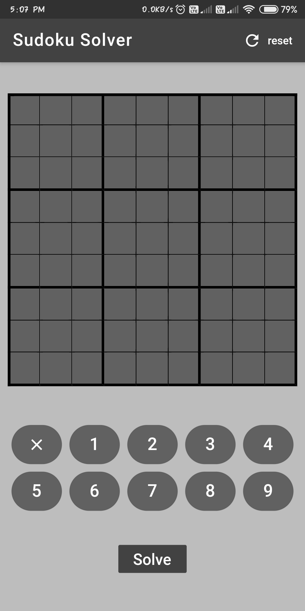
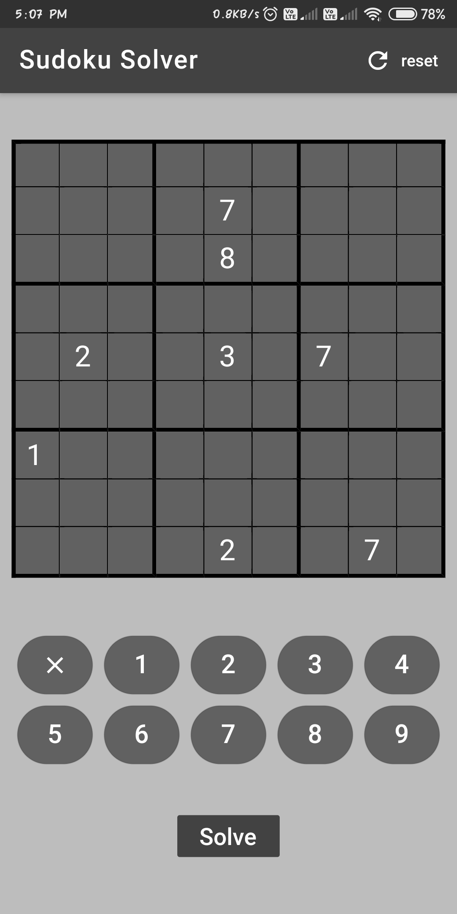

# Sudoku Solver App
## About 
A Sudoku Solver app build with Flutter.

Sudoku is one of the most popular puzzle of all time.
The objective is to fill a 9×9 grid with digits so that each column, each row, and each of the nine 3×3 subgrids that compose the grid contain all of the digits from 1 to 9.

Sudoku is solved using Backtracking technique which builds the solution incrementally (try filling digits one by one). 
## Preview
 
 

For help getting started with Flutter, view
[online documentation](https://flutter.dev/docs), which offers tutorials,
samples, guidance on mobile development, and a full API reference.