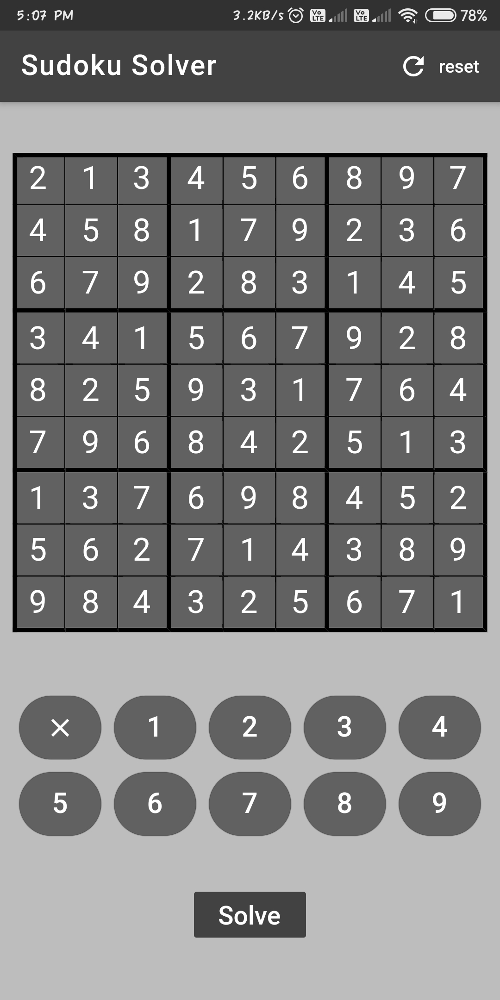

# Sudoku Solver App
## About 
Build with the help of Mobile UI Framework - Flutter.

Sudoku is solved with the help of Backtracking which builds the solution incrementally. 
## Preview
 
 

For help getting started with Flutter, view
[online documentation](https://flutter.dev/docs), which offers tutorials,
samples, guidance on mobile development, and a full API reference.